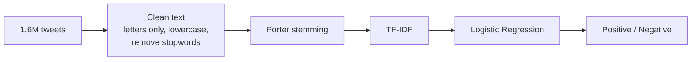

<h1 align="center">Twitter Sentiment Analysis</h1>

<p align="center">
  
  
  
  
</p>

<p align="center">Classifying tweets as positive or negative, trained on 1.6 million tweets from the Sentiment140 dataset.</p>

---

## Data

[Sentiment140](https://www.kaggle.com/datasets/kazanova/sentiment140) has 1,600,000 tweets, split evenly:

| Label | Meaning | Tweets |
|---|---|---|
| 0 | Negative | 800,000 |
| 1 | Positive (originally 4 in the dataset) | 800,000 |

The notebook downloads it with the Kaggle API, so you need a Kaggle account and API key.

## How it works



- **Cleaning:** keep only letters, lowercase, remove English stopwords, stem each word with NLTK's `PorterStemmer`.
- **Split:** 80/20, stratified so both sets have the same positive/negative balance.
- **Features:** `TfidfVectorizer` fit on the training tweets only.
- **Model:** `LogisticRegression(max_iter=1000)`.

## Results

| Model | Test accuracy (320,000 tweets) |
|---|---|
| Logistic Regression | **77.3%** |

I also set up an SVM (`SVC`), but its cell has no saved output, so there's no result for it. Regular `SVC` is very slow on 1.28 million rows. The trained logistic regression model is saved as `logistic_model.pkl`.

## How to run

```bash
git clone https://github.com/DarkMatter1217/Sentiment-analysis.git
cd Sentiment-analysis
pip install pandas numpy nltk scikit-learn matplotlib seaborn kaggle jupyter
jupyter notebook sentiment.ipynb
```

Put your `kaggle.json` API key in `~/.kaggle/` first so the download cell works. Stemming 1.6 million tweets takes a while.

## Known issue

Only the model is saved, not the TF-IDF vectorizer. To predict new tweets outside the notebook you would also need to save the vectorizer (for example with `pickle.dump(vectorizer, ...)`).

## What I would try next

- `LinearSVC` instead of `SVC`, since it scales to millions of rows.
- Word pairs (`ngram_range=(1, 2)`) in the TF-IDF.
- A small transformer model to compare against this baseline.
